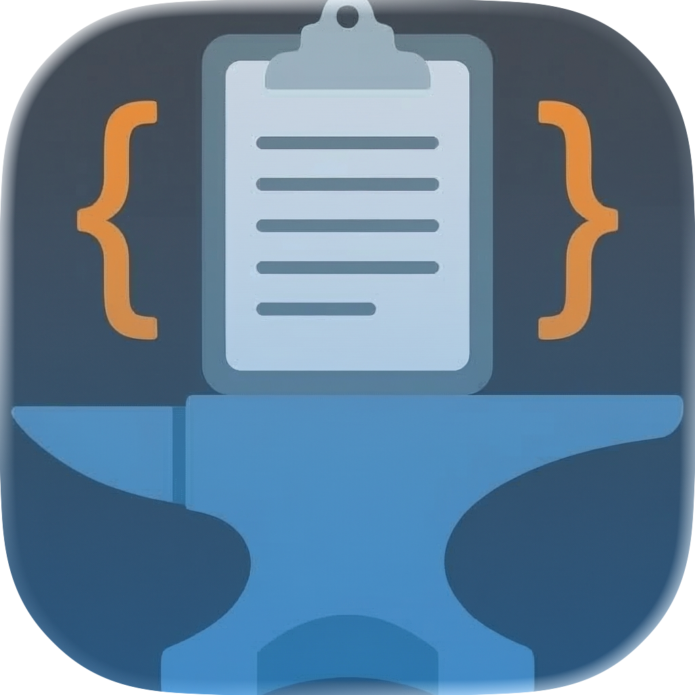

# Clipsmith

A keyboard-first clipboard, snippet, prompt library, and documentation manager for macOS.

Clipsmith keeps your clipboard history, code snippets, AI prompts, and offline documentation one shortcut away. Built natively in Swift for macOS 15+.



## Features

### Clipboard History
- Automatically saves everything you copy
- Scroll back and paste any previous item
- Fuzzy search to find clippings instantly, even with partial or misspelled queries
- Configurable history size, duplicate removal, and password-length filtering

### Code Snippets
- Save frequently used code as named snippets organized into folders
- Syntax-highlighted editor with language detection
- Quick access via keyboard shortcut

### Prompt Library
- Built-in collection of curated AI prompts, searchable and pasteable
- Template variables with `{{variable}}` substitution
- Sync prompts from a remote JSON URL (default: [clipsmith-prompts-library](https://github.com/haad/clipsmith-prompts-library))

### Documentation Lookup (Experimental)
- Offline documentation browser powered by [devdocs.io](https://devdocs.io)
- 789+ documentation sets available (Python, Go, JavaScript, Rust, CSS, Bash, and more)
- Fuzzy search across all downloaded docs
- Doc-scoped search with prefix syntax: `python:map`, `go:fmt`, `css:grid`
- HTML documentation rendered in a split-view panel with dark/light mode support
- Download and manage docs in Settings > Docsets

### Quick Actions
- Transform text: uppercase, lowercase, trim whitespace, sort lines, URL encode, and more
- Available via `Tab` key in the clipboard bezel

### GitHub Gist Sharing
- Share any clipping or snippet as a GitHub Gist
- Automatic language detection for syntax highlighting
- Public or private gists via personal access token

### Import / Export
- Export clipboard history to JSON, CSV, or plain text
- Import history from exported files

## Keyboard Shortcuts

All shortcuts are configurable in Settings > Shortcuts.

| Action | Default Shortcut |
|---|---|
| Open Clipboard | `⇧⌘B` |
| Prompt Library | `⇧⌘P` |
| Documentation Lookup | `⇧⌘D` |
| Open Snippets | `⇧⌘S` |

### Inside the Bezel

| Action | Key |
|---|---|
| Navigate | `↑` `↓` / `j` `k` |
| Paste selected | `⏎` |
| Page up / down | `PageUp` `PageDn` |
| Jump to first / last | `Home` `End` |
| Dismiss | `Esc` |
| Quick actions | `Tab` |

### Documentation Browser

| Action | Key |
|---|---|
| Search | Type in the search field |
| Filter by doc | `python:query`, `go:query` |
| Navigate results | `↑` `↓` |
| Open in browser | `⌘⏎` |
| Dismiss | `Esc` |

## Requirements

- macOS 15 (Sequoia) or later
- Accessibility permission (System Settings > Privacy & Security > Accessibility)

## Building from Source

```bash
git clone https://github.com/haad/Clipsmith.git
cd Clipsmith
open Clipsmith.xcodeproj
```

Build the `Clipsmith` scheme in Xcode 16+. The app runs as a menu bar utility — look for the Clipsmith icon in the menu bar after launching.

### Dependencies (managed via SPM)

- [KeyboardShortcuts](https://github.com/sindresorhus/KeyboardShortcuts) — global hotkey registration
- [HighlightSwift](https://github.com/appstefan/HighlightSwift) — syntax highlighting in snippet editor

## Configuration

### Settings Tabs

- **General** — history size, paste behavior, bezel appearance, menu bar options, feature flags
- **Shortcuts** — record custom keyboard shortcuts for all features
- **Prompts** — manage prompt library, sync URL, template variables
- **Gists** — GitHub personal access token, default visibility
- **Docsets** — browse DevDocs catalog, download/delete documentation sets

### Feature Flags

Some features are behind experimental flags in Settings > General > Features:

- **Documentation Lookup** — enables the doc browser bezel and hotkey (default: off)

## Privacy

All data stays on your Mac. No cloud sync, no analytics, no tracking. GitHub Gist sharing requires a personal access token stored in the macOS Keychain.

## Changelog

### v4.2.0
- Fuzzy search in documentation browser (FuzzyMatcher subsequence matching)
- Doc-scoped search with prefix filter (`python:map`, `go:fmt`)
- Documentation catalog detail panel with homepage/source links
- Fix j/k key interception in doc search field
- Fix bezel auto-closing and reopen issues
- Fix empty content for docs with fragment anchors (bash, CSS, etc.)

### v4.1.0
- Rework documentation backend from Kapeli docsets to devdocs.io
- 789 documentation sets available (was 28)
- Remove GRDB dependency (JSON-based search)
- Documentation Lookup menu bar item with feature flag
- Disable App Sandbox (incompatible with WKWebView + accessibility)
- Resizable, movable doc bezel with persistent frame size
- Dark/light mode CSS for documentation rendering

### v3.0.0
- Fuzzy search in clipboard bezel (Phase 7)
- Quick actions and performance optimizations (Phase 6)
- Prompt library with template variables and remote sync (Phase 5)
- Code snippets with GitHub Gist sharing (Phase 4)
- Full ObjC Flycut parity bug fixes (Phase 3.1)
- SwiftUI bezel overlay with keyboard navigation (Phase 3)
- Core clipboard engine with adaptive polling (Phase 2)
- Foundation: SwiftData schema, accessibility, settings (Phase 1)

## Contributing Prompts

The Clipsmith Prompt Library is community-driven. There are two ways to contribute:

### Option 1: Submit via Issue

[Open a "Submit a Prompt" issue](https://github.com/haad/Clipsmith/issues/new?template=submit_prompt.yml) and fill in the form. We'll review it and add it to the library.

### Option 2: Submit via Pull Request

1. Fork the repository
2. Edit `site/prompts/prompts.json`
3. Add your prompt to the `prompts` array following this structure:

```json
{
  "id": "your-prompt-id",
  "title": "Your Prompt Title",
  "category": "coding",
  "version": 1,
  "content": "Your prompt text here.\n\nUse {{clipboard}} for clipboard substitution."
}
```

**Fields:**

| Field | Description |
|---|---|
| `id` | Unique kebab-case identifier (e.g. `code-review-checklist`) |
| `title` | Short, descriptive name shown in the UI |
| `category` | One of: `analysis`, `coding`, `creative`, `development`, `devops`, `product`, `research`, `writing` |
| `version` | Always `1` for new prompts |
| `content` | The full prompt text. Use `\n` for newlines. |

**Template variables** (auto-substituted when the user pastes):

| Variable | Replaced With |
|---|---|
| `{{clipboard}}` | User's current clipboard content |
| `{{selected_text}}` | Currently selected text in the active app |
| `$ARGUMENTS` | User-provided arguments |

**Guidelines:**
- Check the [existing prompts](https://haad.github.io/Clipsmith/prompts/) to avoid duplicates
- Keep prompts general-purpose (not specific to your company or project)
- Test your prompt with ChatGPT, Claude, or a similar AI assistant before submitting
- Use structured output (numbered lists, markdown headings) for complex prompts

4. Submit a PR with the title: `prompt: Add "Your Prompt Title"`

## License

MIT

## Credits

Clipsmith is a ground-up Swift rewrite inspired by the original [Flycut](https://github.com/TermiT/Flycut) clipboard manager. Documentation powered by [DevDocs](https://devdocs.io) by [freeCodeCamp](https://github.com/freeCodeCamp/devdocs).
